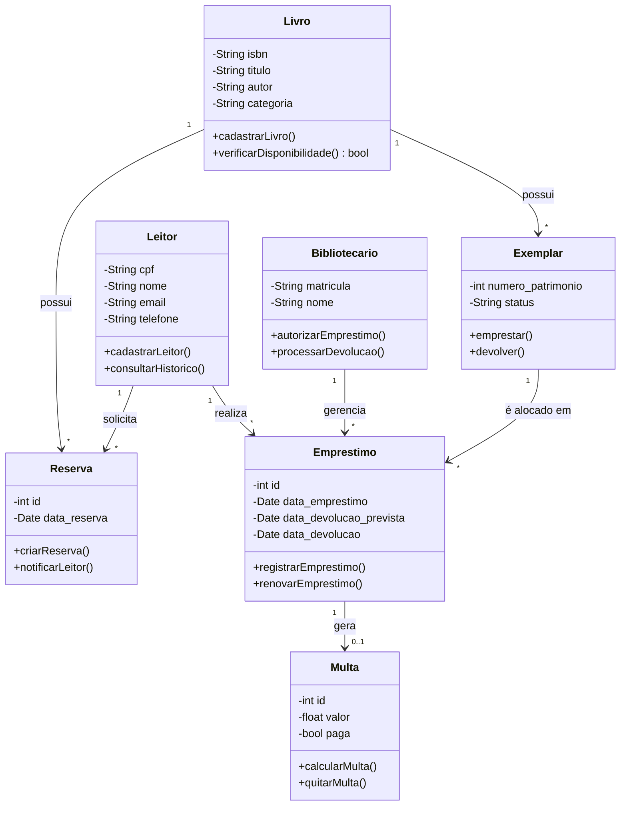
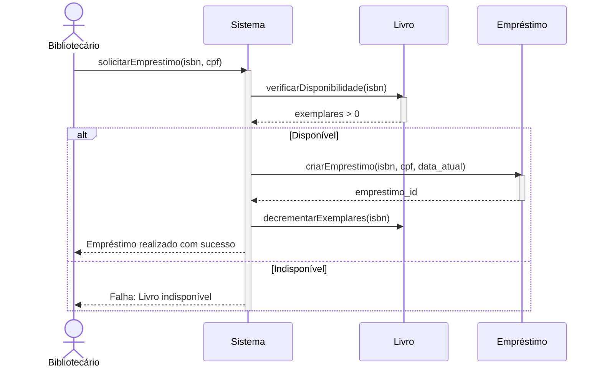
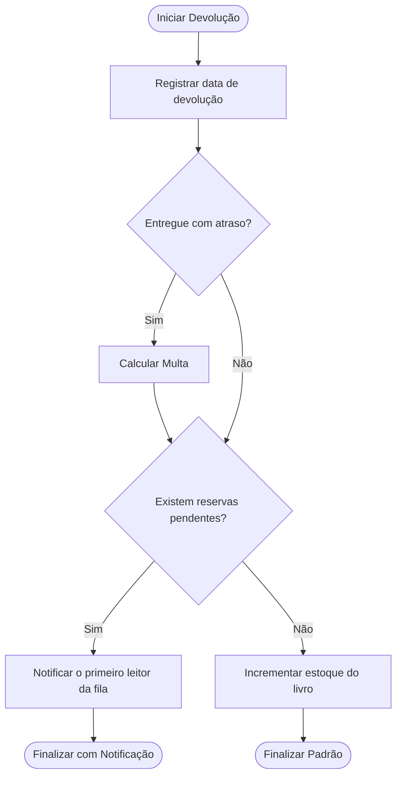

# Análise de Design e Princípios SOLID

## 1. Violações de Princípios SOLID Encontradas

No arquivo `gerenciador_original.py`, a classe `GerenciadorEmprestimo` centraliza múltiplas responsabilidades de forma imperativa, configurando um "God Object".

*   **Violação do SRP (Single Responsibility Principle):** A classe tenta fazer tudo. Ela conecta no banco SQLite, escreve queries SQL em hardcode, orquestra a lógica de negócio (validar disponibilidade, datas), formata e envia e-mails via SMTP, e até desenha PDFs via ReportLab. Cada um desses vetores é uma razão diferente para a classe mudar.
*   **Violação do OCP (Open/Closed Principle):** Se a biblioteca decidir enviar notificações por WhatsApp/SMS no futuro (em vez de e-mail), ou se quiser mudar a biblioteca de PDF, a classe core do negócio terá que ser alterada e reescrita, arriscando quebrar o fluxo de empréstimo.
*   **Violação do DIP (Dependency Inversion Principle):** A lógica de alto nível (regras de empréstimo) está fortemente acoplada a módulos de baixo nível (`sqlite3`, `smtplib`, `reportlab`). Não há abstrações ou interfaces.

## 2. Problemas de Coesão e Acoplamento

*   **Baixa Coesão:** Os métodos como `realizar_emprestimo` agrupam tarefas completamente desconexas (escrever bytes de PDF e calcular `timedelta` de dias não têm coesão de domínio).
*   **Alto Acoplamento:** A classe está acoplada à implementação física do banco de dados (esquema SQL direto no código) e aos servidores do Gmail. Mudanças de infraestrutura quebram a regra de negócio.

## 3. Sugestões de Refatoração

1.  **Isolamento de Banco de Dados:** Criar o padrão *Repository* (ex: `RepositorioLivro`) para isolar as queries SQL e retornar objetos ou dicionários puros.
2.  **Inversão de Controle (IoC):** O `GerenciadorEmprestimo` deve receber as ferramentas (repositórios, serviços de e-mail) já instanciadas através do construtor (Injeção de Dependências).
3.  **Extração de Serviços:** Mover a lógica de `smtplib` para um `ServicoNotificacao` e a de `reportlab` para um `ServicoRelatorio`.

# Modelagem UML - BiblioTech

## A. Diagrama de Classes



## B. Diagrama de Sequência: Realizar Empréstimo

```mermaid
# Análise de Design e Princípios SOLID

## 1. Violações de Princípios SOLID Encontradas

No arquivo `gerenciador_original.py`, a classe `GerenciadorEmprestimo` centraliza múltiplas responsabilidades de forma imperativa, configurando um "God Object".

*   **Violação do SRP (Single Responsibility Principle):** A classe tenta fazer tudo. Ela conecta no banco SQLite, escreve queries SQL em hardcode, orquestra a lógica de negócio (validar disponibilidade, datas), formata e envia e-mails via SMTP, e até desenha PDFs via ReportLab. Cada um desses vetores é uma razão diferente para a classe mudar.
*   **Violação do OCP (Open/Closed Principle):** Se a biblioteca decidir enviar notificações por WhatsApp/SMS no futuro (em vez de e-mail), ou se quiser mudar a biblioteca de PDF, a classe core do negócio terá que ser alterada e reescrita, arriscando quebrar o fluxo de empréstimo.
*   **Violação do DIP (Dependency Inversion Principle):** A lógica de alto nível (regras de empréstimo) está fortemente acoplada a módulos de baixo nível (`sqlite3`, `smtplib`, `reportlab`). Não há abstrações ou interfaces.

## 2. Problemas de Coesão e Acoplamento

*   **Baixa Coesão:** Os métodos como `realizar_emprestimo` agrupam tarefas completamente desconexas (escrever bytes de PDF e calcular `timedelta` de dias não têm coesão de domínio).
*   **Alto Acoplamento:** A classe está acoplada à implementação física do banco de dados (esquema SQL direto no código) e aos servidores do Gmail. Mudanças de infraestrutura quebram a regra de negócio.

## 3. Sugestões de Refatoração

1.  **Isolamento de Banco de Dados:** Criar o padrão *Repository* (ex: `RepositorioLivro`) para isolar as queries SQL e retornar objetos ou dicionários puros.
2.  **Inversão de Controle (IoC):** O `GerenciadorEmprestimo` deve receber as ferramentas (repositórios, serviços de e-mail) já instanciadas através do construtor (Injeção de Dependências).
3.  **Extração de Serviços:** Mover a lógica de `smtplib` para um `ServicoNotificacao` e a de `reportlab` para um `ServicoRelatorio`.
```mermaid
classDiagram
    class Livro {
        -String isbn
        -String titulo
        -String autor
        -String categoria
        +cadastrarLivro()
        +verificarDisponibilidade() bool
    }
    
    class Exemplar {
        -int numero_patrimonio
        -String status
        +emprestar()
        +devolver()
    }
    
    class Leitor {
        -String cpf
        -String nome
        -String email
        -String telefone
        +cadastrarLeitor()
        +consultarHistorico()
    }
    
    class Emprestimo {
        -int id
        -Date data_emprestimo
        -Date data_devolucao_prevista
        -Date data_devolucao
        +registrarEmprestimo()
        +renovarEmprestimo()
    }
    
    class Reserva {
        -int id
        -Date data_reserva
        +criarReserva()
        +notificarLeitor()
    }
    
    class Multa {
        -int id
        -float valor
        -bool paga
        +calcularMulta()
        +quitarMulta()
    }
    
    class Bibliotecario {
        -String matricula
        -String nome
        +autorizarEmprestimo()
        +processarDevolucao()
    }

    Bibliotecario "1" --> "*" Emprestimo : gerencia
    Leitor "1" --> "*" Emprestimo : realiza
    Leitor "1" --> "*" Reserva : solicita
    Livro "1" --> "*" Exemplar : possui
    Exemplar "1" --> "*" Emprestimo : é alocado em
    Livro "1" --> "*" Reserva : possui
    Emprestimo "1" --> "0..1" Multa : gera
```

## B. Diagrama de Sequência: Realizar Empréstimo



## C. Diagrama de Atividades: Devolução e Reservas


```

## C. Diagrama de Atividades: Devolução e Reservas

