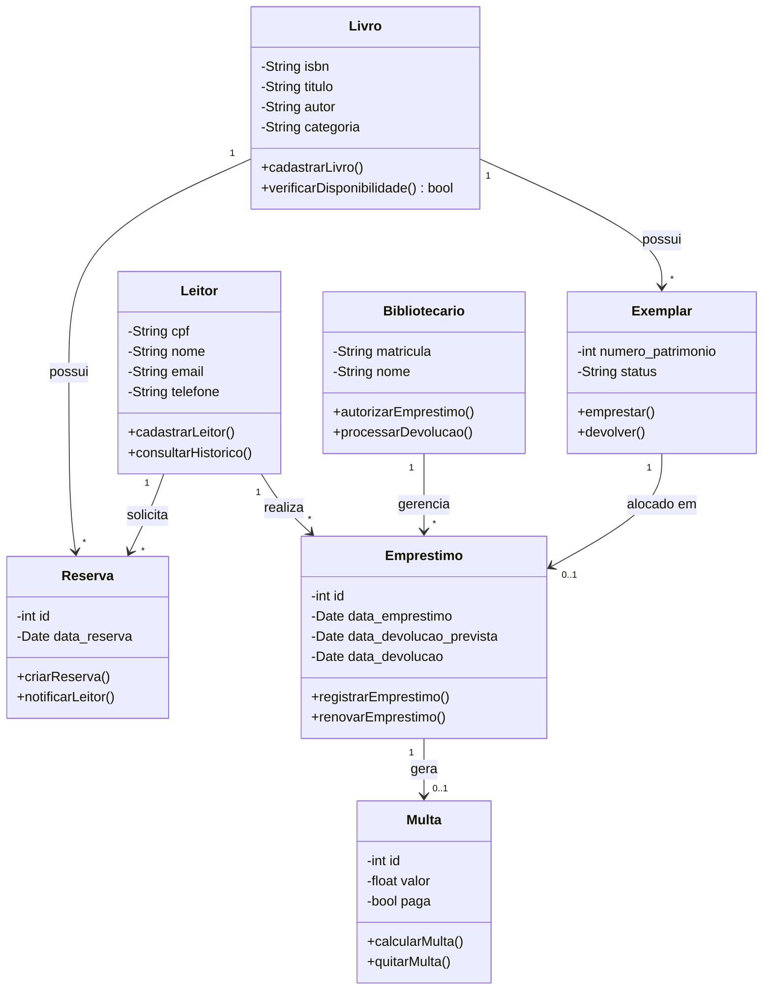
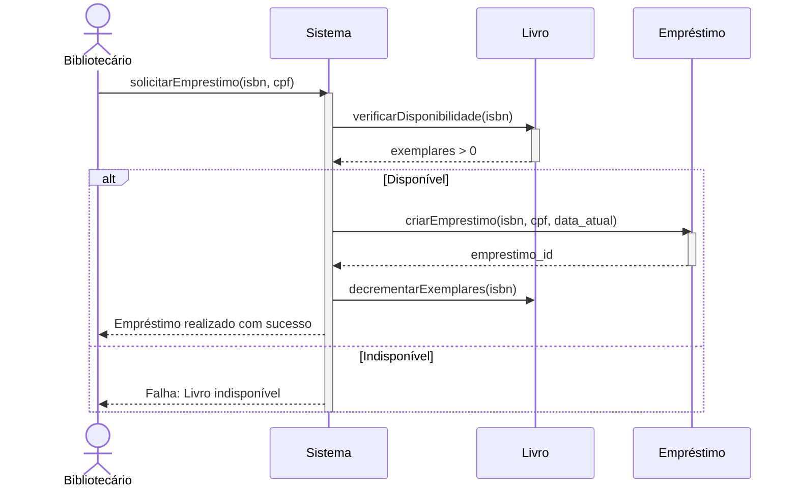
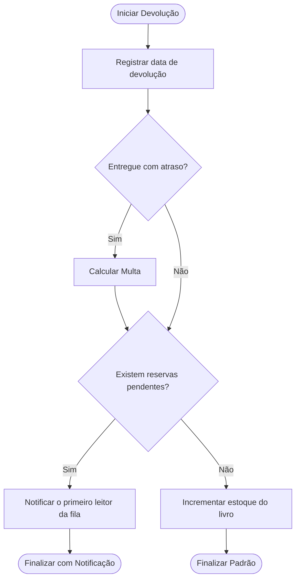

# Modelagem UML - BiblioTech

## A. Diagrama de Classes

```mermaid
classDiagram
    class Livro {
        -String isbn
        -String titulo
        -String autor
        -String categoria
        +cadastrarLivro()
        +verificarDisponibilidade() bool
    }
    
    class Exemplar {
        -int numero_patrimonio
        -String status
        +emprestar()
        +devolver()
    }
    
    class Leitor {
        -String cpf
        -String nome
        -String email
        -String telefone
        +cadastrarLeitor()
        +consultarHistorico()
    }
    
    class Emprestimo {
        -int id
        -Date data_emprestimo
        -Date data_devolucao_prevista
        -Date data_devolucao
        +registrarEmprestimo()
        +renovarEmprestimo()
    }
    
    class Reserva {
        -int id
        -Date data_reserva
        +criarReserva()
        +notificarLeitor()
    }
    
    class Multa {
        -int id
        -float valor
        -bool paga
        +calcularMulta()
        +quitarMulta()
    }
    
    class Bibliotecario {
        -String matricula
        -String nome
        +autorizarEmprestimo()
        +processarDevolucao()
    }

    Bibliotecario "1" --> "*" Emprestimo : gerencia
    Leitor "1" --> "*" Emprestimo : realiza
    Leitor "1" --> "*" Reserva : solicita
    Livro "1" --> "*" Exemplar : possui
    Exemplar "1" --> "0..1" Emprestimo : alocado em
    Livro "1" --> "*" Reserva : possui
    Emprestimo "1" --> "0..1" Multa : gera
```

## B. Diagrama de Sequência: Realizar Empréstimo

```mermaid
sequenceDiagram
    actor B as Bibliotecário
    participant S as Sistema
    participant L as Livro
    participant E as Empréstimo
    
    B->>S: solicitarEmprestimo(isbn, cpf)
    activate S
    S->>L: verificarDisponibilidade(isbn)
    activate L
    L-->>S: exemplares > 0
    deactivate L
    
    alt Disponível
        S->>E: criarEmprestimo(isbn, cpf, data_atual)
        activate E
        E-->>S: emprestimo_id
        deactivate E
        S->>L: decrementarExemplares(isbn)
        S-->>B: Empréstimo realizado com sucesso
    else Indisponível
        S-->>B: Falha: Livro indisponível
    end
    deactivate S
```

## C. Diagrama de Atividades: Devolução e Reservas

```mermaid
flowchart TD
    A([Iniciar Devolução]) --> B[Registrar data de devolução]
    B --> C{Entregue com atraso?}
    
    C -- Sim --> D[Calcular Multa]
    D --> E{Existem reservas pendentes?}
    
    C -- Não --> E
    
    E -- Sim --> F[Notificar o primeiro leitor da fila]
    F --> G([Finalizar com Notificação])
    
    E -- Não --> H[Incrementar estoque do livro]
    H --> I([Finalizar Padrão])
```